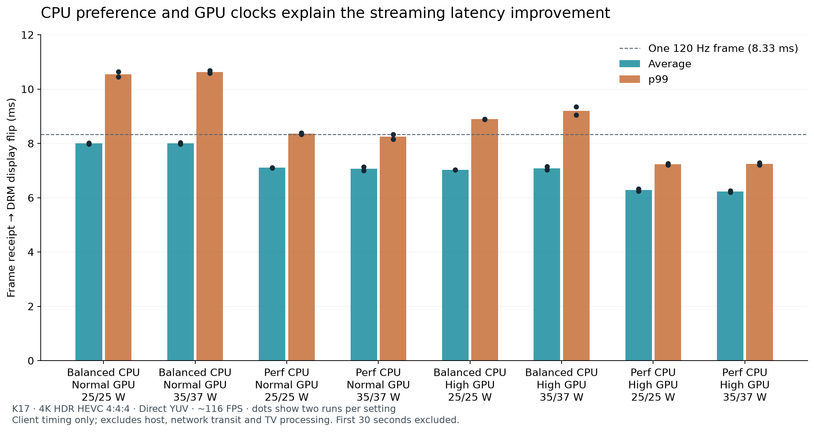

# Performance and boot measurements

Moonmachine uses BORE and ThinLTO. See the [kernel measurements](experimental/bore-thinlto/README.md#checks-and-measurements)
for the scheduler latency comparison. Client streaming latency is covered in the [latency analysis](docs/LATENCY.md).
Game FPS and physical end-to-end input-to-photon latency have not been measured.

## Measured boot improvement

The K17 (Core Ultra 5 226V / Arc 130V) booted with our stock-kernel replacement
modules before and after disabling JetKVM's unused virtual USB mass-storage
function and restoring graphical boot arguments:

| Stage | Before | After |
|---|---:|---:|
| Firmware | 71.651 s | 10.313 s |
| Bootloader | 4.596 s | 4.120 s |
| Kernel | 0.766 s | 0.703 s |
| Initramfs | 44.565 s | 4.533 s |
| Userspace to graphical target | 8.068 s | 8.368 s |
| Total | 129.649 s | 28.038 s |

Visual checks confirmed a faster graphical startup without console text. This measures
systemd's graphical target, not the time until Steam finishes loading.
JetKVM remains usable for keyboard, mouse and audio. Its mass-storage function
must be re-enabled deliberately for future virtual-media installs.

Quiet boot uses quiet/rhgb, suppressed console status and cursor, and removes
drm.debug=0x6/log_buf_len=8M. Logs remain in the journal. Plymouth's existing
BGRT theme retains the firmware logo. The graphical boot helper can hide the normal one-second menu while preserving
explicit recovery/menu requests.
Firmware-generated error screens cannot be controlled by Linux.

## CPU and filesystem

A 25 W CPU load test reached 74 C without increasing thermal-throttling counters.
No general performance advantage was established for forcing full preemption or
performance EPP. Keep the E cores available for background work.

Btrfs remains the filesystem. The test system uses zstd:1 compression; compression
applies to new writes. No filesystem migration or whole-disk recompression is
required by the image. Alternate filesystem performance has not been measured.

Earlier scheduler comparisons are recorded in [tuning results](experimental/tuning/README.md).

## Direct YUV with and without machine tuning (22 September)

Three consecutive 4K HDR 4:4:4 streams used the same published image and settings,
excluding the first 30 seconds of each run:

| Settings | Frames | Mean receipt-to-display | p99 | Drops |
|---|---:|---:|---:|---:|
| CPU performance, GPU floors 1850/1200 MHz, package 35/37 W | 8,411 | 6.10 ms | 7.14 ms | 0 |
| CPU balance_performance, GPU floors 800/400 MHz, package 25/25 W | 8,450 | 8.03 ms | 10.19 ms | 0 |
| Original tuning restored | 8,456 | 6.12 ms | 7.10 ms | 0 |

This combined A/B/A comparison supports a repeatable benefit from the tuning
bundle; it does not isolate each setting. Earlier power-limit tests alone found
little benefit. GPU floors stay within the hardware's supported frequency range.
These are client timings, excluding host, network transit and TV processing.
The stock run's slowest frame was 15.80 ms; restored tuning's was 8.47 ms.

## Which tuning settings help streaming? (23 September)

CPU performance preference and higher GPU minimum clocks each reduced latency.
Increasing the package power limits from 25/25 W to 35/37 W had no consistent
effect in this streaming workload.

All eight combinations were measured twice, with the order reversed for the
second pass. Each run used Overcooked 2’s idle startup/menu sequence, streamed
at 4K HDR HEVC 4:4:4 through Direct YUV at about 116 FPS. The first 30 seconds
were excluded. Settings were read back before and after every run.

| Settings | Mean | p99 |
|---|---:|---:|
| Baseline | 8.00 ms | 10.55 ms |
| Higher power limits only | 8.00 ms | 10.63 ms |
| CPU performance preference only | 7.10 ms | 8.36 ms |
| Higher GPU floors only | 7.02 ms | 8.89 ms |
| CPU preference + GPU floors | 6.29 ms | 7.24 ms |
| All three | 6.22 ms | 7.25 ms |

The table averages the two runs’ means and p99 values. All sixteen valid runs
had zero recorded frame drops. One earlier sample was discarded after a
controller-disconnection notification switched Moonlight to Vulkan.

- **CPU preference:** `performance` instead of `balance_performance`, with the
  governor left at `powersave`. Across matched comparisons, this saved 0.85 ms
  on average and 2.05 ms at p99. Submission-to-flip time fell from about 1.55 ms
  to 0.97 ms; decode wait was largely unchanged.
- **GPU floors:** 1850/1200 MHz instead of 800/400 MHz for GT0/GT1, with unchanged
  maximum clocks. This saved 0.89 ms on average and 1.30 ms at p99. Decode wait
  fell from roughly 5.5 ms to 4.6 ms. These floors stay within the supported range.
- **Power limits:** the matched average change was −0.007 ms; p99 changes went
  in both directions. Measured average package power was about 5–7 W, below
  either limit. Higher limits may matter for local games; that was not tested.

Bars average the two runs; dots show each run. Measurements cover first packet
receipt on the client through DRM display flip, excluding host processing,
network transit before receipt and TV processing. Raw percentile summaries and
stage timings are in [the results data](docs/tuning/summary.json). The first pass
was inspected incrementally; the second was collected uninterrupted and
confirmed the same pattern. These settings remain outside the shared image.
