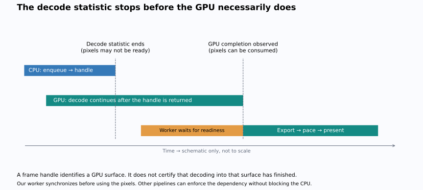
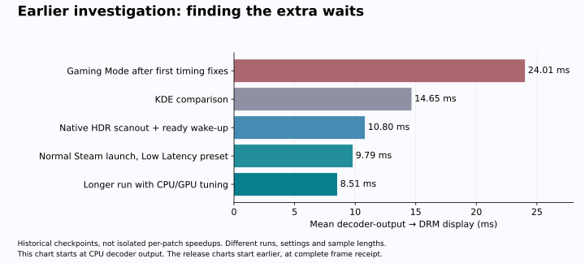
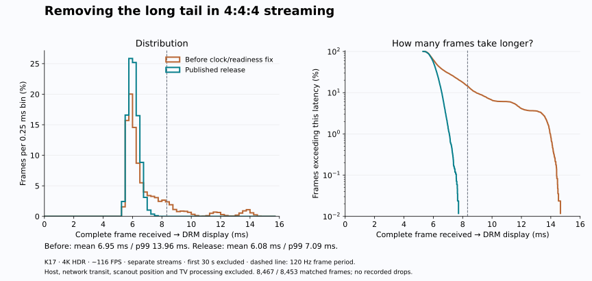
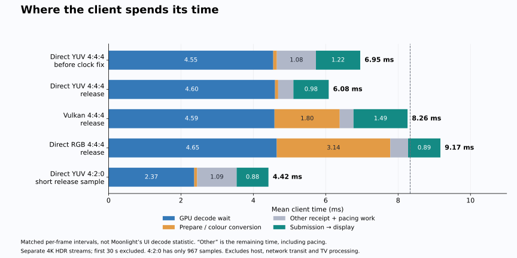

# Getting a 4K HDR stream onto the TV in about 6 ms

Moonmachine started with a display problem: getting the GMKtec K17's Intel Arc
130V to output 4K120, 10-bit HDR and working VRR over HDMI. Once that worked,
streaming exposed a second problem. Moonlight could receive and decode 116 frames
per second while displaying only about 63. Even after fixing that, frames spent
far too long waiting inside the client.

The current release's Direct YUV 4:4:4 path averages **6.08 ms**, with **99% of
measured frames at or below 7.09 ms**. That is the time from receiving a complete
encoded frame to the Linux display driver's timestamp for showing it. It excludes
the gaming PC, network transit, the position of a pixel during scanout, and the
TV's own processing. We have not measured button-to-photon latency.

This is the story of how we found the waits, removed unnecessary work, and fixed
the occasional slow frames without turning off HDR, VRR or V-sync.

## First, make the measurements mean something

### A frame handle is not a finished frame

Yes, this is a consequence of asynchronous processing. The CPU submits decoding
work to the GPU and can continue before the GPU finishes. FFmpeg can return an
`AVFrame` containing a reference to a GPU surface—a handle identifying where the
picture will be—while decoding into that surface is still in progress. This lets
CPU work and GPU work overlap instead of forcing the CPU to wait at every step.

In the Moonlight FFmpeg path we tested, the **decode-time statistic stops shortly
after `avcodec_receive_frame()` returns a frame**, before it is handed to the
pacing/rendering worker. It accumulates the elapsed time since the decode unit's
`enqueueTimeUs`, then averages that over decoded frames. It is neither a timer
around the GPU's actual execution nor proof that the pixels are ready. It can
include time queued before decoder output while excluding GPU work that finishes
later.

The statistic is therefore misleading if read as “time until decoding is fully
complete.” It measures a real interval, but its endpoint is too early for that
interpretation on this asynchronous hardware path. A sub-millisecond value in
the overlay can coexist with several more milliseconds before the surface is
usable. Different drivers may block at different points, so comparing that
number between Intel and AMD does not establish which GPU finishes first.

For a concrete example, saved 4:4:4 session statistics reported **0.28–0.29 ms
average decoding time**—about the 0.3 ms shown in the overlay. The published
4:4:4 trace measured **4.60 ms from CPU decoder output to observed GPU readiness**.
Those are different intervals from separate captures, not a matched per-frame
ratio: the important point is that the roughly 0.3 ms statistic omitted several
milliseconds of subsequent waiting for usable pixels.

Before anything **reads the pixels**, decoding must have completed. That includes
CPU readback, a shader sampling the surface, colour conversion and direct display
scanout. Reading the handle or metadata does not require finished pixels. The
consumer can wait explicitly, or the GPU/display pipeline can enforce a dependency
using synchronization objects, often called fences. The CPU does not inherently
have to block, but the consumer cannot safely ignore that dependency.

Our current VAAPI direct path explicitly calls `vaSyncSurface()` in the worker,
then exports and retains the surface. It never copies those pixels to the CPU.
The late wait is outside Moonlight's original decode statistic; our trace records
CPU decoder output and observed GPU readiness separately. In the published 4:4:4
run, that later interval averaged about **4.60 ms**. It includes when the worker
observed readiness, so it is not an exact measurement of pure GPU execution time.
Nor should it simply be added to a decode statistic from a different session.

This distinction also explains why we kept asynchronous decoding. Making FFmpeg
block just to make the overlay number look complete would move the wait and could
reduce useful overlap. We needed better measurement and correctly placed
synchronization, not a serialized pipeline.

The relevant code is in the release's
[FFmpeg statistics path](https://github.com/Cynary/moonlight-qt/blob/1de7ea05/app/streaming/video/ffmpeg.cpp)
and [direct renderer](https://github.com/Cynary/moonlight-qt/blob/1de7ea05/app/streaming/video/ffmpeg-renderers/directwayland.cpp).
This describes the tested Linux/VAAPI implementation; other decoder backends can
account for completion differently. The diagram shows ordering, not measured
durations.

### Matching frames to actual display times

We added per-frame tracing around reception, decoder output, GPU synchronization,
preparation, pacing and submission. Frames were matched by submission ID to
Gamescope's display feedback. We also used offline clips and colour patterns to
test decoding and rendering independently of Windows, the network and the TV.

The feedback itself needed fixing. Gamescope was returning predicted display
times through its Vulkan timing interface. Most preceded Moonlight's submission
and were rejected. The DRM backend now reports the first measured page flip for
the corresponding frame. A page flip is the display controller switching to the
new picture. Gamescope still sends its early application-progress notifications;
we changed the timing evidence, not the mechanism that lets applications proceed.

The first corrected capture produced 23,198 usable samples instead of 53. There
were still 28 future-dated rejections in that historical run. Those were excluded;
we did not clamp them into believable timestamps. See the
[timing report](TIMING-VALIDATION.md) for the original counts and test limits.

## Why 116 incoming frames became 63 displayed frames

Gamescope's uncapped VRR scheduling path interacted badly with Moonlight's paced
FIFO presentation. FIFO means frames are presented in order. Excluding FIFO
clients from the uncapped scheduling gate restored about 116 submissions per
second. That small change is carried in the image alongside the conservative
`adaptive_sync_uncapped=false` default.

There was another limit inside Moonlight. It did not recognise Gamescope's FIFO
handling as synchronized presentation, so it added its own minimum spacing.
At 120 Hz, that was roughly 8.67 ms: enough to cap a 116 FPS stream at about
115.4 FPS. A small mismatch accumulates into a queue. Recognising Gamescope's
handling removed that extra limit while preserving V-sync and VRR.

The buffer controller also retained old protection too readily. Errors unrelated
to frame readiness could hold the buffer up, and skipped frames reset all the
history needed to lower it. The fix attributes protection to actual readiness
misses and keeps observed clean intervals across skips. In the live comparison,
mean queue waiting fell from **8.99 to 1.62 ms**. We did not impose an arbitrary
8.33 ms buffer cap or set all pacing to zero.

MoonDeck's background splash was a separate source of extra updates. Pausing it
when unfocused stopped repeated background frames from driving the TV toward
120 Hz during a 60 FPS stream. That behaviour is now in the pinned upstream
MoonDeck used by the image.

## Getting Gamescope out of the critical path

The desktop comparison was useful: the same class of stream was much quicker
under KDE than in Gaming Mode. It narrowed the search to the presentation path.

Two things mattered. First, a transparent Steam overlay placeholder and an
SDR-conversion setting could force composition even when a single HDR stream
could be displayed directly. Composition renders the game and interface into a
new image; direct scanout lets the display controller read the existing image.
We allowed native HDR scanout when no real overlay needs drawing.

Second, a frame whose GPU work had already finished did not wake the compositor
like a frame completing asynchronously did. It could wait for another event.
Fixing that reduced measured ready-frame dispatch from about **2.22 ms to
0.046 ms** in a short trace.

These are checkpoints from different runs, not additive savings attributable to
individual patches. Low Latency mode and higher media-engine minimum clocks
helped further. Raising the package power limit did not materially help this
streaming workload, which used about 7 W. The CPU/GPU tuning used for these
measurements is recorded separately from the shared image defaults.

## Making Intel 4:4:4 practical

Intel could decode the 4:4:4 stream, but libplacebo could not import its packed
Y410 and XYUV8888 surfaces. These are GPU memory layouts, not different HDMI
colour modes. We added the missing mappings and channel order so libplacebo can
sample the surfaces and convert their colours without reading them back to the
CPU. Moonlight must be rebuilt too because this import helper is in a header.

Offline checks compared rendered patterns with software-decoded reference
frames. The 8-bit comparison was exact; the 10-bit HDR pattern's maximum RGB
error was 0.00001526 in float16 output. A longer offscreen run rendered 7,200
4K 4:4:4 frames at about 157 FPS. That establishes a working GPU import path,
not a display-latency measurement. [Full colour/import results](CHROMA-VALIDATION.md).

We then added a path that avoids Moonlight's colour-conversion render pass.
**Direct YUV** passes the decoded surface to Gamescope and lets the display
hardware perform conversion during scanout. Gamescope needed packed-YUV support
for direct display and for cases where it must compose. The same work now covers
P010, the 10-bit 4:2:0 format. **Direct RGB** uses VAAPI video processing to convert
first. **Vulkan** remains selectable and is the fallback when direct presentation
is unsupported.

Overlays are a useful exception. Composing a YUV video surface with statistics
was substantially slower. Moonlight now switches to its warmed Vulkan renderer
while an overlay is visible, then returns to direct presentation. The decoder
keeps running. Earlier switching tests still showed a brief gap—55 ms on opening
statistics and 25 ms on closing—so the transition is not seamless.

## The last problem was the tail, not the average

Direct YUV was averaging roughly 7 ms, but some frames took almost 15 ms. Two
subtleties were responsible for avoidable waiting.

Exporting a decoded surface late could wait for the *next* decode job to finish
reading it as a reference. We now export it immediately after synchronization
and retain the descriptor until presentation. This changes when the export
happens; it does not serialize all decoding behind display.

Doing that alone was not enough. The pacing model used GPU readiness to estimate
the source clock. Variable GPU waits therefore moved its estimate of when the
host produced frames and could preserve extra delay. The model now observes the
clock at CPU decoder output and treats GPU readiness as a separate constraint.
A frame still cannot be displayed before it is ready. Existing host cadence and
pacing rules remain in place; this is not a zero-buffer mode.

The earlier Direct YUV build had a **13.96 ms p99**. The published image has a
**7.09 ms p99**, across 8,453 matched frames after warm-up. Its slowest measured
frame was 7.72 ms, and no drops were recorded in that window. Two development
runs also stayed below 8.33 ms. The streams were separate live runs, not an
identical encoded replay; longer play and network disruption can produce other
results. The candidate was visually checked and reported smooth.

Release preparation caught two more mistakes: trace metadata did not reflect
the new policy, and observing readiness could accidentally make a stale queued
frame appear young again. Both were corrected and covered by tests before the
release. Old trial traces retain usable measured timestamps but need corrected
policy metadata before exact policy replay.

## Where the time goes now

| Published path | Frames | Mean | p99 | Maximum |
|---|---:|---:|---:|---:|
| Direct YUV 4:4:4 | 8,453 | 6.08 ms | 7.09 ms | 7.72 ms |
| Vulkan 4:4:4 | 3,818 | 8.26 ms | 9.56 ms | 10.59 ms |
| Direct RGB 4:4:4 | 3,825 | 9.17 ms | 10.27 ms | 11.09 ms |
| Direct YUV 4:2:0 | 967 | 4.42 ms | 5.54 ms | 5.89 ms |

All four measured windows recorded zero drops. The 4:2:0 sample is short because
that run also exercised overlay switching. Its chroma resolution is lower than
4:4:4; it is not equivalent picture quality for fine coloured text.

In Direct YUV 4:4:4, about **4.60 ms** is measured GPU decode waiting, **0.09 ms**
is preparation and **0.98 ms** is submission-to-display. The remaining **0.42 ms**
contains receipt/dispatch work and pacing. These intervals are measured at the
client, not hardware performance-counter measurements of pure decoder execution.
Submission-to-display also includes scheduling and the display's permitted
presentation time, so it is not entirely removable software overhead.

## What ships, and what remains

The [release audit](RELEASE-AUDIT-20260922.md) lists the exact image, sources,
patches and an important omission: the later Xbox suspend candidate is not yet
packaged. The shared image includes the HDMI/VRR and recovery driver, patched
Gamescope, Moonlight and libplacebo, upstream MoonDeck, graphical boot, Wi-Fi
and earlier Xbox reconnection fixes. It updates through the signed GHCR channel.

These measurements used a K17, 4K HDR HEVC, roughly 116 FPS, Overcooked 2 and the
test machine's CPU/GPU performance tuning. The first 30 seconds were excluded
from release comparisons. There were no temporary Moonlight/Gamescope binary
overrides in the booted release. We have not measured physical TV latency or
calibrated the full direct-HDR display path, and other GPUs are untested.

The [anonymized per-frame data and plotting scripts](latency/README.md) accompany
this article. The earlier [timing report](TIMING-VALIDATION.md) and
[release validation](STREAMING-VALIDATION.md) retain the detailed test history.
Changes, measurements and this analysis were developed with OpenAI Codex;
visual feedback came from testing on the actual TV.
